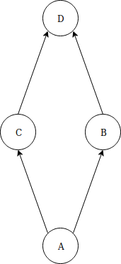

# soi-semafory
Symulacja urzędu przy użyciu 4 procesów oraz 4 kolejek. Implementacja oparta na wykorzystaniu procesów i semaforów. 




Rys. 1. Schemat urzędu.


### Proces symulacji
Procesy należy uruchomić w osobnych terminalach.

``` 
make
./procA
```
```
./procB
```
```
./procC
```
```
./procD
```


### Co poprawić?
* Napisać komentarze w pliku queue.h.
* Zredukować redundancję kodu w procesach poprzez stworzenie odpowiednich funkcji dla konsumenta i producenta w pliku queue.c.